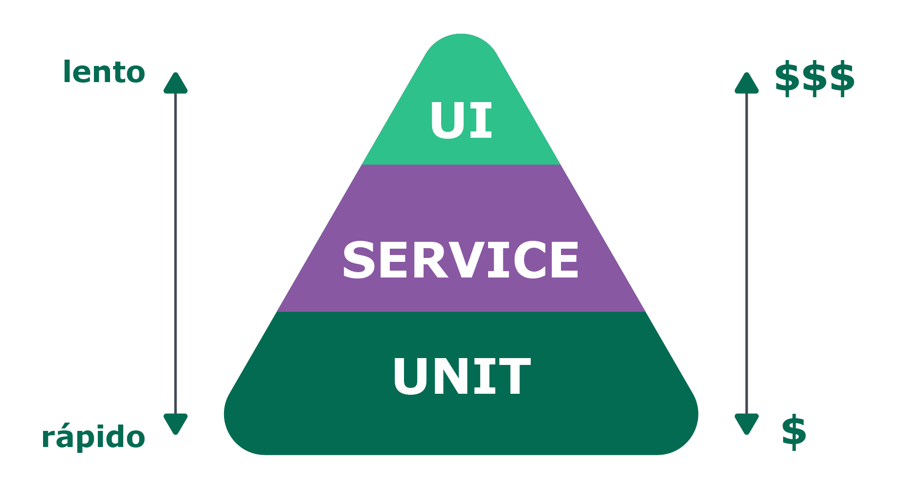
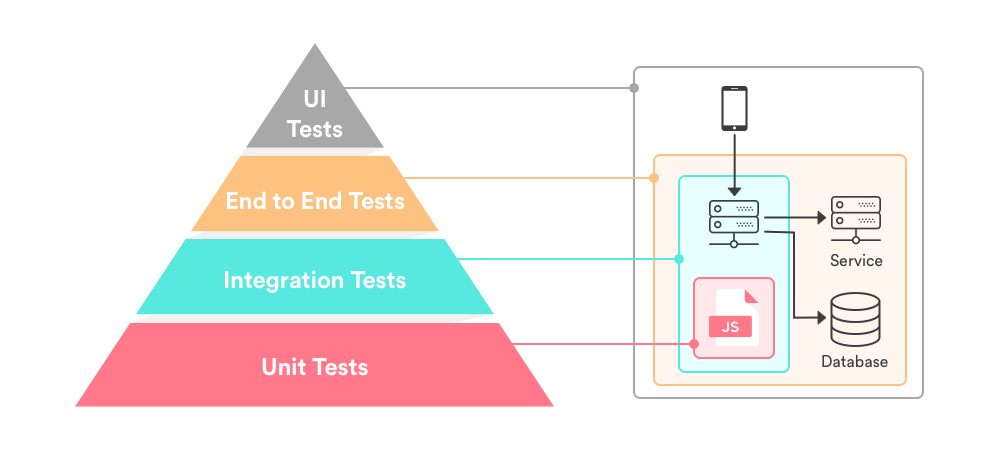

<!-- For syntax highlighting -->
<link rel="stylesheet" href="./src/slide.css">

### Testes de integração 🥳 {style=color:#50fa7b}

{width=60%}

---

#### O que é um teste de integração ❓ {style=color:#50fa7b}

**Testa como as coisas trabalham juntas**

---

---

#### O que é um teste de integração ❓ {style=color:#50fa7b}

**É tudo que não é um teste de unidade - Vladimir Khorikov**

---

#### Pirâmide de testes {style=color:#50fa7b}

---

#### Pirâmide de testes {style=color:#50fa7b}

---

#### É muito importante ter um balanço entre os tipos de testes {style=color:#50fa7b}

{width=20%}

---

### Chai Request {style=color:#50fa7b}

{width=70%}

---

#### O que testes de integração ajudam? {style=color:#50fa7b}

- A testar duas ou mais unidades juntas

- A testar um código já existente

- A testar códigos que não são tão bem escritos

- ótimo para empresas que querem começar a testar algo pronto

---

### ✋ Dúvidas? {style=color:#50fa7b}

{ width=70% }

---

### Show me the code! {style=color:#50fa7b}

---

### ✋ Dúvidas? {style=color:#50fa7b}

{ width=70% }

---

### 🛑 PAUSA

<h5>⏰ 6 minutos e 11 segundos</h5>

---

### [🏁 Checkpoint 🏁](https://wall.sli.do/event/0vg6tp6e){style=color:#50fa7b}

<iframe data-src="https://wall.sli.do/event/0vg6tp6e" width="845" height="455" frameborder="0" marginwidth="0" marginheight="0" style="border:none; margin-bottom:5px; max-width: 100%;" allowfullscreen=""></iframe>

---

### FIM! {style=color:#50fa7b}

